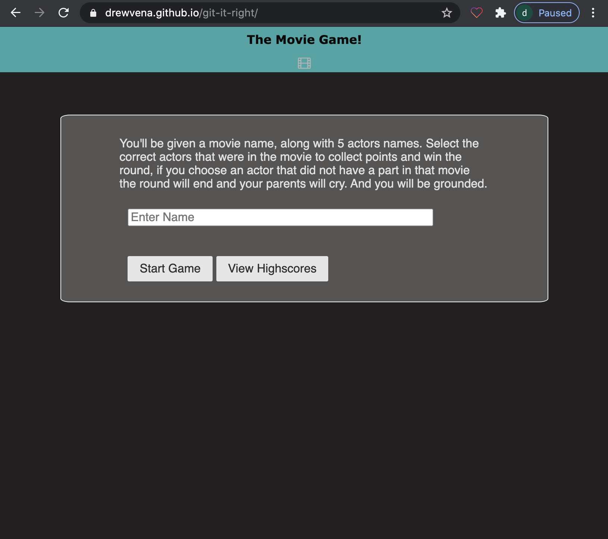
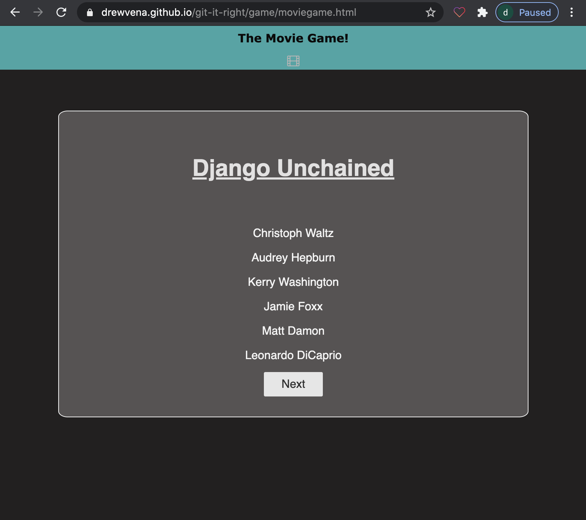
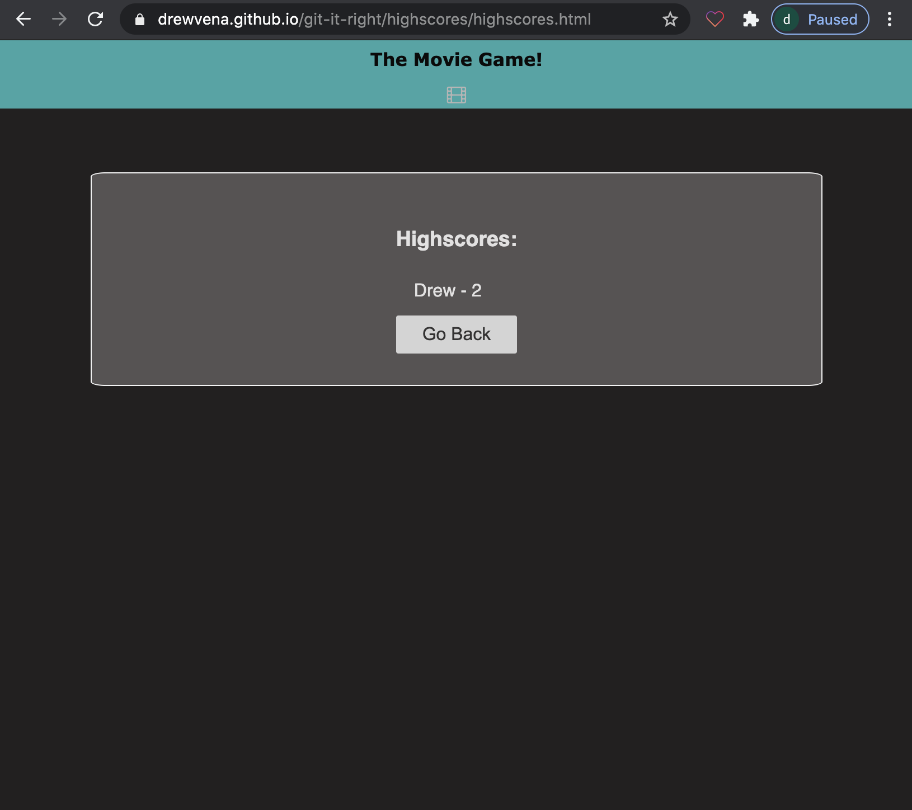

# movie-trivia
The Movie Game uses an the OMDb API to gather information on films and grabs the top 4 actors from each individual movie. The game also randomly generates the movie along with two incorrect answers. There is 4 correct answers and 2 incorrect answers! 

The game also uses the giphy api to fetch gifs based on user input criteria (such as the movie name and the actors name that the user clicks.) 

Highscores are saved to local storage and displayed!

LINK TO DEPLOYED APPLICATION:
https://drewvena.github.io/git-it-right/

LINK TO GITHUB REPOSITORY: https://github.com/drewvena/git-it-right

